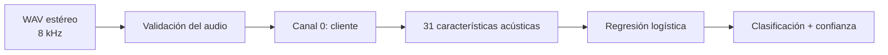

# Human vs. Synthetic Voice Detector

Sistema desarrollado para el **Altur Challenge de HackMTY 2026**. Recibe una llamada telefónica y determina si la voz del cliente pertenece a una persona o fue generada mediante inteligencia artificial.

La versión final utiliza un modelo acústico desplegado mediante **FastAPI**. El servicio recibe un audio, analiza únicamente el canal del cliente y devuelve una clasificación acompañada de un score de confianza.

## Problema

Las voces sintéticas son cada vez más naturales. En una llamada telefónica, reconocerlas solamente por su contenido puede ser difícil, especialmente cuando sistemas humanos y artificiales siguen el mismo flujo de conversación.

El reto consiste en clasificar al caller como:

- `human`: persona real.
- `synthetic`: sistema autónomo con reconocimiento de voz, modelo de lenguaje y voz sintética.

El sistema debe exponer un endpoint `POST /detect` que reciba una llamada y entregue la clasificación.

## Dataset

El dataset contiene **353 llamadas en español mexicano**:

| Split | Human | Synthetic | Total |
| --- | ---: | ---: | ---: |
| Train | 113 | 169 | 282 |
| Validation | 37 | 34 | 71 |
| **Total** | **150** | **203** | **353** |

Cada llamada es un archivo WAV:

- PCM de 16 bits.
- Frecuencia de muestreo de 8 kHz.
- Dos canales.
- Canal 0: cliente que debe clasificarse.
- Canal 1: agente de atención.

El reto indica que `train` y `val` no comparten callers. La evaluación final utiliza voces que no aparecen en esos conjuntos.

Los audios se distribuyen por separado y no se incluyen en este repositorio.

## Enfoques explorados

Durante el desarrollo evaluamos tres fuentes de información.

### 1. Señales acústicas

El modelo acústico analiza directamente el sonido del canal del cliente mediante 31 características:

- 13 MFCC, representados por su media y desviación estándar.
- Media y variación de la energía RMS.
- Media y variación del tono estimado.
- Proporción de ventanas donde se detectó tono.

Estas variables representan aspectos del timbre, la energía y el comportamiento tonal de la voz.

La clasificación se realiza con una regresión logística que incluye imputación de valores faltantes y escalado de variables.

### 2. Comportamiento conversacional

También analizamos la dinámica de la llamada:

- Número de intervenciones del cliente.
- Duración promedio y variación de sus intervenciones.
- Tiempo promedio de respuesta.
- Variación de los tiempos de respuesta.
- Proporción de la llamada durante la cual habla el cliente.

Este enfoque mostró información útil, pero depende de conocer previamente los turnos de cada participante. El endpoint oficial recibe solamente el audio, por lo que el módulo necesitaría generar y validar esos turnos durante la inferencia antes de poder desplegarse de manera confiable.

### 3. Lenguaje

El módulo lingüístico estudió:

- Cantidad y velocidad de palabras.
- Diversidad léxica.
- Muletillas.
- Repeticiones.
- Autocorrecciones.
- Expresiones de confusión y reparación conversacional.

Durante esta etapa detectamos un problema: los audios originales estaban a 8 kHz, pero los arrays enviados a Whisper eran interpretados como audio a 16 kHz. Esto podía alterar la duración y el contenido percibidos por el transcriptor.

Corregimos el proceso mediante:

- Selección del canal 0.
- Remuestreo de 8 kHz a 16 kHz.
- Reutilización de una sola instancia de Whisper.
- Registro separado de resultados vacíos y errores.
- Guardado progresivo del procesamiento.

Después de la corrección:

| Resultado | Antes | Después |
| --- | ---: | ---: |
| Transcripciones vacías | 174 | 0 |
| Errores registrados | No diferenciados | 0 |
| Palabras recuperadas | 3,495 | 35,822 |
| Llamadas procesadas | 353 | 353 |

La recuperación de texto demuestra que el nuevo proceso funciona mejor, aunque no sustituye una evaluación manual de la precisión de cada transcripción.

## Resultados

### Validación cruzada dentro de train

| Modelo | Accuracy | F1 synthetic | ROC-AUC | Log loss |
| --- | ---: | ---: | ---: | ---: |
| **Acústico** | **98.58%** | **0.9882** | **0.9986** | **0.0502** |
| Lingüístico corregido | 78.72% | 0.8276 | 0.8672 | 0.4573 |

La imputación, el escalado y el entrenamiento se realizaron dentro de cada partición para evitar utilizar información de la parte evaluada.

### Split oficial de validación

| Modelo | Accuracy | F1 synthetic | ROC-AUC | Log loss |
| --- | ---: | ---: | ---: | ---: |
| **Acústico desplegado** | **97.18%** | **0.9714** | **1.0000** | **0.1074** |

Matriz de confusión del modelo acústico:

| Clase real | Predicha human | Predicha synthetic |
| --- | ---: | ---: |
| Human | 35 | 2 |
| Synthetic | 0 | 34 |

El modelo clasificó correctamente **69 de 71 llamadas**. Detectó las 34 llamadas sintéticas y confundió dos llamadas humanas con voces sintéticas.

También se evaluaron fusiones experimentales:

| Configuración histórica | Accuracy en val | ROC-AUC |
| --- | ---: | ---: |
| Acústico + conductual | 97.18% | 0.9984 |
| Acústico + conductual + lingüístico anterior | 97.18% | 0.9976 |

Estas fusiones no mejoraron la accuracy observada. La versión de tres módulos se probó antes de corregir las transcripciones y no representa una evaluación del lenguaje corregido.

## ¿Por qué elegimos el modelo acústico?

Elegimos el modelo acústico porque ofreció la mejor combinación de precisión, estabilidad y facilidad de despliegue:

- Obtuvo el mejor rendimiento individual.
- Las fusiones evaluadas no aumentaron la accuracy.
- Trabaja directamente con el audio que recibe el endpoint.
- No necesita transcripción durante cada petición.
- No depende de archivos externos con turnos de conversación.
- Tiene menos componentes que puedan fallar durante la evaluación.
- Produce una respuesta rápida y fácil de integrar.
- El clasificador guardado ocupa solamente 4,329 bytes.

Una solución más compleja solo resulta conveniente cuando demuestra una mejora estable y puede ejecutarse con las entradas disponibles. En nuestras pruebas, el acústico fue la alternativa mejor respaldada.

## Arquitectura final



El modelo se carga una sola vez al iniciar FastAPI y se reutiliza en todas las peticiones.

## Respuesta del sistema

Ejemplo de una voz sintética:

```json
{
  "is_synthetic": true,
  "confidence": 0.9821
}
```

Ejemplo de una voz humana:

```json
{
  "is_synthetic": false,
  "confidence": 0.9970
}
```

`confidence` representa la probabilidad asignada por el modelo a la clase elegida. Es un score del modelo y no una garantía de que la clasificación sea correcta.

## Instalación

Implementación verificada en Ubuntu con Python 3.14.

```bash
git clone https://github.com/LeonParedes0712/HackMTY-Altur-2026.git
cd HackMTY-Altur-2026

python3.14 -m venv .venv
source .venv/bin/activate

python -m pip install -r requirements.txt
python -m pip check
```

El modelo final ya está incluido en:

```text
models/acoustic_logistic.pkl
```

No es necesario volver a entrenarlo para ejecutar la API.

## Ejecutar la API

```bash
python -m uvicorn src.api.main:app \
  --host 0.0.0.0 \
  --port 8000 \
  --workers 1
```

Comprobar el servicio:

```bash
curl http://127.0.0.1:8000/health
```

Respuesta:

```json
{
  "status": "ok",
  "model": "acoustic_logistic"
}
```

La documentación interactiva de FastAPI está disponible en:

```text
http://localhost:8000/docs
```

## Endpoints

### `POST /detect`

Endpoint oficial. Recibe el WAV completo codificado en base64:

```json
{
  "audio": "<WAV_EN_BASE64>"
}
```

Ejemplo desde el repositorio:

```bash
python -m src.acoustic.request_detection audio/call_04d682ac0cef.wav
```

### `POST /detect-upload`

Endpoint auxiliar para la demostración. Permite subir el WAV directamente desde Swagger o mediante `curl`:

```bash
curl -X POST \
  http://127.0.0.1:8000/detect-upload \
  -F "file=@audio/call_04d682ac0cef.wav"
```

Ambos endpoints utilizan el mismo modelo y la misma función de predicción.

## Validaciones de entrada

La API comprueba:

- Base64 válido.
- Contenedor WAV.
- PCM de 16 bits.
- Frecuencia de 8 kHz.
- Dos canales.
- Audio con duración válida.
- Presencia de señal en el canal del cliente.
- Límites de tamaño de la petición.

## Pruebas

Instalar las dependencias adicionales:

```bash
python -m pip install -r requirements-test.txt
```

Ejecutar:

```bash
python -m unittest discover -s tests -p "test_api.py" -v
python tests/smoke_uvicorn.py
```

Las pruebas cubren:

- `/health`.
- `/detect` con base64.
- `/detect-upload`.
- Llamadas humanas y sintéticas.
- Base64 inválido.
- Formatos incorrectos.
- Audio truncado o vacío.
- Consistencia entre ambos endpoints.

## Estructura principal

```text
.
├── models/
│   └── acoustic_logistic.pkl
├── src/
│   ├── acoustic/
│   │   ├── features.py
│   │   ├── predict.py
│   │   ├── preprocess.py
│   │   ├── request_detection.py
│   │   ├── validation.py
│   │   └── train_model.py
│   ├── behavior/
│   ├── language/
│   └── api/
│       └── main.py
├── tests/
├── docs/
├── requirements.txt
└── README.md
```

## Prevención de sobreajuste

Durante el desarrollo:

- Se mantuvieron separados `train` y `val`.
- Se utilizó validación cruzada dentro de `train`.
- La imputación y el escalado se ajustaron dentro de cada partición.
- Los IDs, etiquetas y metadatos del procesamiento quedaron fuera de las variables.
- Se buscaron duplicados exactos mediante hashes del archivo, audio PCM y canal del cliente.
- No se encontraron duplicados exactos entre las 353 llamadas.
- Se prefirió un modelo sencillo cuando las alternativas más complejas no demostraron una mejora.

Aun así, no afirmamos que el modelo esté libre de sobreajuste:

- El conjunto `val` fue consultado durante el desarrollo y sus resultados deben considerarse exploratorios.
- No contamos con IDs de hablante para agrupar la validación cruzada interna.
- Los hashes no detectan audios aproximadamente duplicados.
- El desempeño final debe confirmarse con las voces ocultas del reto y con llamadas externas.

## Limitaciones

- El modelo fue entrenado con llamadas de este reto.
- No se ha demostrado su rendimiento en otros idiomas, codecs o condiciones telefónicas.
- La confianza todavía no cuenta con una evaluación independiente de calibración.
- La API exige WAV estéreo, PCM de 16 bits y 8 kHz.
- La clasificación de voz sintética no demuestra fraude, suplantación ni intención maliciosa.
- El módulo lingüístico depende de transcripción automática.
- El módulo conductual necesita generar y validar turnos desde el audio antes de incorporarse a producción.

## Trabajo futuro

- Evaluar el sistema con más hablantes y generadores de voz.
- Calibrar el score de confianza con datos independientes.
- Generar turnos directamente desde el audio.
- Evaluar nuevamente las fusiones con validación anidada.
- Medir latencia y capacidad de procesamiento.
- Integrar el detector con una plataforma de atención telefónica.

## Uso de los datos

El dataset fue proporcionado exclusivamente para HackMTY 2026. Los audios no se incluyen ni deben redistribuirse. Las personas participantes utilizaron información personal ficticia y no debe intentarse identificarlas.

## Documentación adicional

- [Operación de FastAPI](docs/fastapi.md)
- [Revisión del modelo](docs/corrected-model-review.md)
- [Verificación de la entrega](docs/delivery.md)
